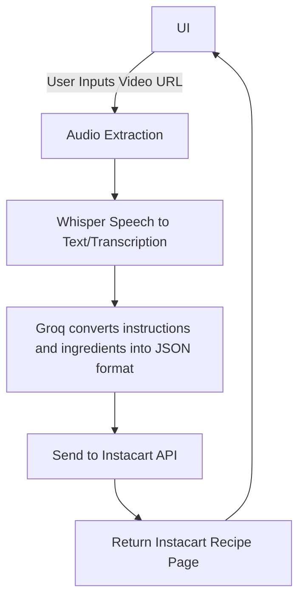

# InstaCook

This document provides an overview of the data flow for our web application, InstaCook, which processes a recipe video URL input to generate and return the instructions and ingredient list to the user interface (UI).

## Table of Contents
- [Introduction](#introduction)
- [Data Flow Steps](#data-flow-steps)
- [Flowchart](#flowchart)
- [Technologies Used](#technologies-used)
- [Installation](#installation)
- [Usage](#usage)
- [Contributing](#contributing)
- [License](#license)

## Introduction

InstaCook takes a video URL input from the user, extracts the audio, transcribes it, processes the transcription with Groq to generate a JSON response, and sends this JSON to the Instacart API. The API returns an ingredient list that is displayed in the UI.

## Data Flow Steps

1. **UI**: The user provides a video URL through the application's UI.
2. **Audio Extraction**: The audio from the provided video URL is extracted.
3. **Whisper Speech to Text/Transcription**: The extracted audio is transcribed into text using Whisper.
4. **Groq Processing**: The transcribed text is processed using Groq to extract instructions and ingredients into a JSON format.
5. **Send to Instacart API**: The JSON object is sent to the Instacart API (pending approval).
6. **Return Ingredient List to UI**: The Instacart API processes the JSON and returns an ingredient list.
7. **UI**: The returned ingredient list is displayed back in the UI for the user.

## Flowchart



## Technologies Used

1. [yt-dlp Youtube downloader](https://github.com/yt-dlp/yt-dlp) - Download and extract audio from youtube video link.
2. [ffmpeg audio conversion](https://ffmpeg.org) - Convert the extracted audio to 16khz sample rate which is required by openai/whisper.
3. [transformer speech2text](https://huggingface.co/learn/audio-course/en/chapter2/asr_pipeline) - OpenApi open source whisper model (until groq enables public access for their speech2text api).
4. [groq fast ai inference](https://console.groq.com/docs/libraries) - Llama3-70b-8192 using groq api to extract recipe title, instructions and ingredients; generate instacart api request
5. [instacart developer api](https://docs.instacart.com/developer_platform_api/guide/tutorials/create_a_recipe_page) - Creating a recipe page with developer api.

## Installation

1. Create a new conda environment using

```bash
conda create -n insta-cook python=3.11
```

2. Activate the conda environment

```bash
conda activate insta-cook
```

3. Install the requiered python modules using

```bash
pip install -r requirements.txt
```

## Usage

1. Create a [groq account](https://console.groq.com) and get api key.
2. Input the generated key in `.env` file in the project directory and add the value as `GROQ_API_KEY=<your_generated_key>` 
>Note: I have delete my api key ;)
3. Follow installation instructions above
4. Run 
```bash
python yt_instacart_recipie.py
```